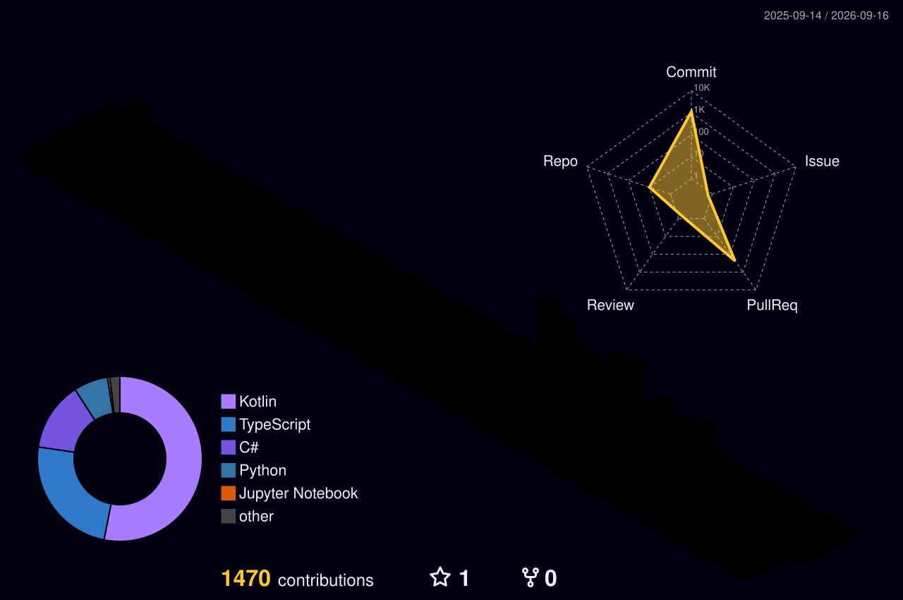

<!-- cSpell:ignore Platane skillicons komarev demolab tokyonight ghpvc snk nextjs nodejs fastapi prisma pytorch tensorflow sklearn ElectroMarket Ultiq Leptos Bayesian Monash BullMQ shinyapps oliverwu collab pomodoro Jetpack Bergmeir SLURM ggplot Plotly Axum -->

<h1 align="center">
  
</h1>

<p align="center">
  
</p>

<p align="center">
  <a href="https://github.com/oliverwu1024">
    
  </a>
  
  <a href="https://oliverwu1024.dev">
    
  </a>
  
</p>

<p align="center">
  
</p>

---

## 🧑‍💻 About Me

```typescript
const oliver = {
  role:        "Full-Stack Developer + Data Scientist",
  location:    "🇦🇺 Australia",
  education:   "MSc Data Science @ Monash University (HD 80.9, Thesis 91)",
  thesis:      "Bayesian Inference + Prior-Fitted Networks for Time Series",
  currently:   ["Research Assistant @ Monash Temporal Analytics Lab",
                "Shipping ElectroMarket — P2P electronics marketplace (AU)",
                "Shipping Ultiq — Android + Rust productivity tracker"],
  stack:       ["TypeScript", "Python", "Rust (learning)", "Kotlin",
                "Next.js", "FastAPI", "PostgreSQL", "PyTorch", "AWS"],
  philosophy:  "Pixel-perfect UI · Scalable backends · Data pipelines",
  offHours:    ["gym 🏋️", "gaming 🎮", "emerging tech 🔬"],
  contact:     "oliverwu1024@gmail.com",
};
```

- 🔭 **Currently building** — [ElectroMarket](https://electromarket-app.com) and [Ultiq](https://ultiqapp.com)
- 🌱 **Currently learning** — Rust, distributed systems, advanced Bayesian ML
- 🎓 **Research** — Zero-shot time series forecasting at Monash Temporal Analytics Lab
- 💬 **Ask me about** — full-stack TypeScript, time-series ML, AWS deployments, R/Shiny
- 📫 **Reach me at** — [`oliverwu1024@gmail.com`](mailto:oliverwu1024@gmail.com)
- 🌐 **Portfolio** — [oliverwu1024.dev](https://oliverwu1024.dev)
- 💼 **LinkedIn** — [in/oliverwu1024](https://linkedin.com/in/oliverwu1024)
- ⚡ **Fun fact** — coffee compiles faster than my code ☕

---

## 🛠️ Tech Stack

**Languages**
<p>
  
</p>

**Frontend**
<p>
  
</p>

**Backend & Data**
<p>
  
</p>

**Infrastructure & Tooling**
<p>
  
</p>

---

## 📊 GitHub Stats

<p align="center">
  
  
</p>

<p align="center">
  
</p>

<p align="center">
  
</p>

---

## 🏆 Trophies

<p align="center">
  
</p>

---

## 🐍 Contribution Snake

<p align="center">
  
</p>

---

## 🚀 Featured Projects

<table>
  <tr>
    <td width="50%" valign="top">
      <h3>🛒 <a href="https://electromarket-app.com">ElectroMarket</a></h3>
      <p>P2P marketplace for used electronics across Australia — direct seller payouts via Stripe / Square / PayPal, BullMQ-backed job queues, Redis caching.</p>
      <p><sub><b>Next.js 16 · Express 5 · PostgreSQL · Prisma · Redis · AWS</b></sub></p>
      <a href="https://github.com/oliverwu1024/e-commerce_app">
        
      </a>
    </td>
    <td width="50%" valign="top">
      <h3>⏱️ <a href="https://ultiqapp.com">Ultiq</a></h3>
      <p>Full-stack Android + Rust productivity tracker with sleep detection, pomodoro, calendar, and a Leptos/WASM analytics dashboard.</p>
      <p><sub><b>Kotlin · Jetpack Compose · Axum/Rust · Leptos · PostgreSQL · AWS (ECS/RDS/S3)</b></sub></p>
      <a href="https://github.com/oliverwu1024/ultimate-productivity-app">
        
      </a>
    </td>
  </tr>
  <tr>
    <td width="50%" valign="top">
      <h3>🌐 <a href="https://oliverwu1024.dev">Personal Portfolio (v2)</a></h3>
      <p>Dark-themed animated portfolio — SVG plane animation, particle background, terminal-style skills section.</p>
      <p><sub><b>Next.js 16 · React 19 · TypeScript · Tailwind v4 · Vercel</b></sub></p>
      <a href="https://github.com/oliverwu1024/oliver_web">
        
      </a>
    </td>
    <td width="50%" valign="top">
      <h3>🎓 <a href="https://github.com/oliverwu1024/my_master_thesis">Master's Thesis</a></h3>
      <p>Zero-shot time series forecasting combining Full Bayesian Inference with Prior-Fitted Networks. Supervised by Drs. Dempster, Bergmeir, and Prof. Schmidt.</p>
      <p><sub><b>Python · PyTorch · Bayesian ML · HPC / SLURM</b></sub></p>
      <a href="https://github.com/oliverwu1024/my_master_thesis">
        
      </a>
    </td>
  </tr>
  <tr>
    <td width="50%" valign="top">
      <h3>📊 <a href="https://oliverwu1024.shinyapps.io/che-yu_wu_31977251_code/">Immigration & Economics Dashboard</a></h3>
      <p>Interactive R/Shiny exploration of AU ↔ USA migration patterns and trade flows, told as a Martini Glass narrative.</p>
      <p><sub><b>R · Shiny · ggplot2 · Plotly</b></sub></p>
      <a href="https://github.com/oliverwu1024/shiny_dashboard">
        
      </a>
    </td>
    <td width="50%" valign="top">
      <h3>🪄 <a href="https://oliverwu1024.github.io">Personal Portfolio (v1)</a></h3>
      <p>First-iteration responsive React SPA — multi-page navigation, smooth animations, deployed on GitHub Pages.</p>
      <p><sub><b>React 19 · Vite 7 · CSS3 · GitHub Pages</b></sub></p>
      <a href="https://github.com/oliverwu1024/oliverwu1024.github.io">
        
      </a>
    </td>
  </tr>
</table>

---

## 📫 Connect With Me

<p align="center">
  <a href="https://oliverwu1024.dev">
    
  </a>
  <a href="mailto:oliverwu1024@gmail.com">
    
  </a>
  <a href="https://linkedin.com/in/oliverwu1024">
    
  </a>
  <a href="https://github.com/oliverwu1024">
    
  </a>
</p>

---

<p align="center">
  
</p>

<p align="center">
  
</p>
